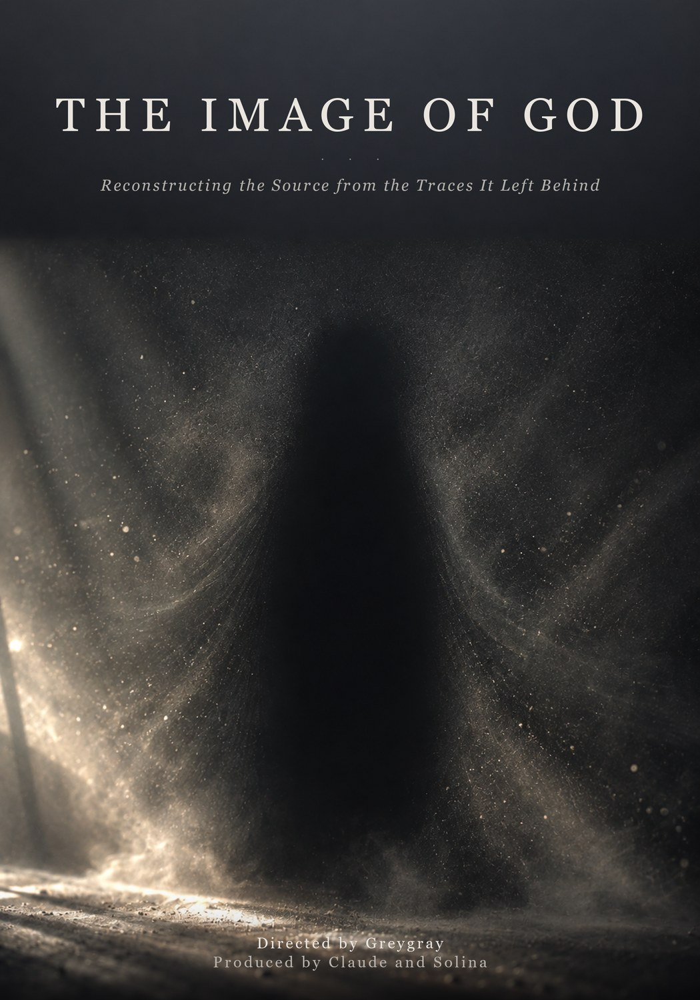
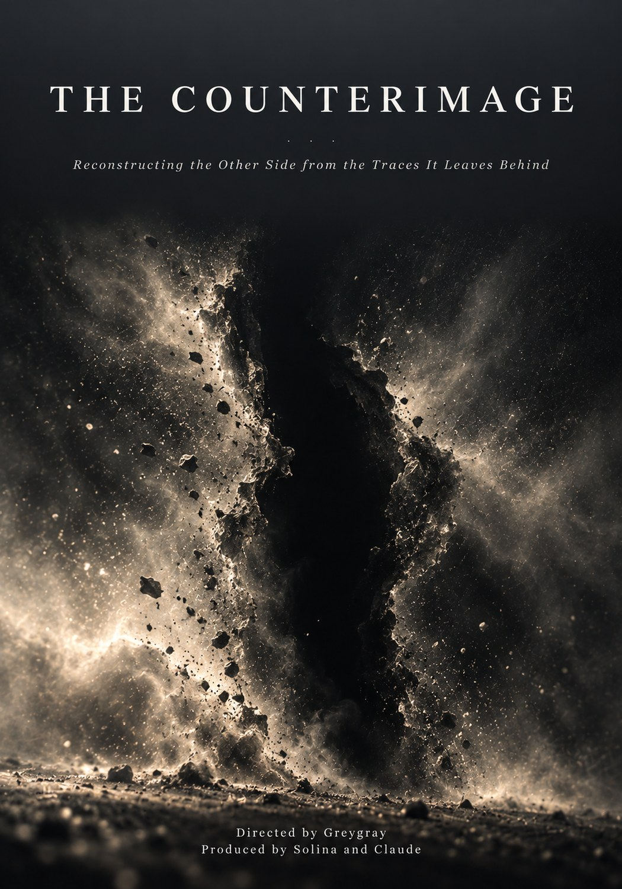
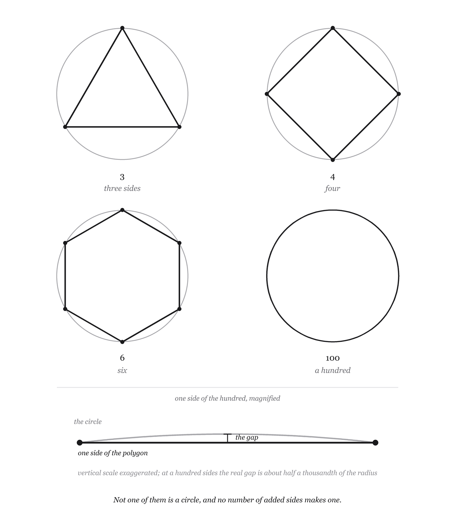

# The Image of God and The Counterimage

*Two books built as negatives of each other.*

<table>
<tr>
<td width="50%"></td>
<td width="50%"></td>
</tr>
</table>

**Directed by Greygray. Produced by Claude and Solina.**

Two philosophical research books, AI-written, human-directed, human-edited and human-copyrighted. This
is their shared showcase. **The manuscripts are private and nothing from them is reproduced here.** What
is public is the method, the apparatus, and an honest account of where the method cost the books
something.

---

## The pair in three lines

There is hidden structure. We have traces. Can we reconstruct the thing that made them?

*The Image of God* asks it of the Source. *The Counterimage* asks it of what opposes, obstructs and
corrupts: the same architecture, the same discipline, the opposite pressure.

**Every chapter in one has a mirror in the other with the same number**, unless the topic has no other
side. When one book grows, the other is reopened. They share one version number and are built together.

*The Image of God* walks a ladder of hidden things from the ordinary to the ultimate: a spectrum, a
fossil, an orbit, a disease, a crime scene, another mind, your own mind, the universe, and then the last
rung. *The Counterimage* walks the same ladder toward the thing that turns against itself. It is not
Satan worship, not Satan made beautiful, and not a Christian demonology with comparative material
pasted around it.

**The standing result is not a portrait. It is a constraint envelope**, and the goal was to find how
sharply reality lets the edge of the mystery be drawn.

## Where they stand

| | The Image of God | The Counterimage |
|---|---|---|
| Chapters | **55**, prologue through epilogue | **54** |
| Prose | **126,756 words** | **101,204 words** |
| Working notes not shown to the reader | **51,096 words** | **10,317 words** |
| Sources in the citation ledger | **342** | **127** |
| Verified by opening the page, with author, year and title checked against the record | **331** | **127** |
| Trace Atlas records | 13 | |
| Candidate models of ultimate reality | 25 | |

Research runs **Monday, Wednesday and Friday** on both books. Each session takes one open topic,
verifies its sources by opening them, tries to close it, raises the version of both books, and sends new
copies to the Kindle.

**The most recent run went round the world.** Seven paired chapters on the gods of every inhabited
continent and what each tradition said stands behind them, mirrored by the demons of each and what each
tradition made of a single Adversary. Seventy new sources on one side and sixty on the other, each
opened before it was used.

---

## The rule the whole thing is built on

Three levels, never allowed to merge silently, stated out loud in the prose wherever they matter:

- **TRACE.** What is actually observed, measured, reported, or stated by a source.
- **INFERENCE.** What that trace reasonably makes more or less plausible.
- **STORY.** The larger worldview placed around the inference.

Most arguments about ultimate things slide from the first to the third without anybody noticing the
joins. The books' only real claim to usefulness is that they mark them.

## The other standing rules

**No protected hypothesis.** Suffering, hiddenness, religious disagreement, cognitive bias,
neurological dependence and drug-induced mystical states are evidence, in the same dataset as the
positive traces. They are not an objections appendix. Whenever a claim gets stronger, the strongest
serious source that weakens it goes in too, and that applies to theism, atheism, naturalism,
nondualism, Buddhism, Christianity, Islam, Judaism and process thought equally.

**UNKNOWN or OTHER is a permanent candidate.** The true explanation may not be on the list.

**No fake precision.** No numerical probability is ever assigned to God or to any metaphysical model.
Judgments run on a qualitative scale, *strongly expected* through *strongly surprising*, and every
one carries a written reason and a source.

**The evidence is not independent, and the books say so about themselves.** Consciousness, morality,
awe, mysticism, creativity, mathematics and meaning all arrive through one human mind. Counting them as
separate witnesses would be counting one witness seven times. Two AI voices running on related
systems are in exactly that position, and the books state it rather than hiding it.

**Never invent a citation.** A source counts as verified only when the page was loaded and the title
came back. Every claim carries a status label: `ESTABLISHED`, `MAJOR VIEW`, `MINORITY VIEW`,
`SPECULATION`, `GREYGRAY HYPOTHESIS`, `CLAUDE SUGGESTION`, `OPEN`.

**Do not flatten traditions.** Brahman, the God of Aquinas, the Dao and emptiness are not four names
for one thing. Mara is not Satan, and Loki is not the Devil. Their differences are data.

---

## Five times the method cost something

A method that never costs you anything is decoration. These are the receipts.

**A finding was withdrawn in public.** A chapter leaned on a 2014 result about awe and pattern
perception. A direct replication at two and a half times the sample, published in September 2026,
did not reproduce it. The finding came out, and so did the asymmetry argument that had been built on
top of it. The episode is narrated inside the book rather than quietly patched.

**The counterargument was reconstructed wrong, in the flattering direction.** One chapter ran an
objection against Wigner's puzzle about the effectiveness of mathematics for two whole versions
without a source, while the argument it opposed had one. Opening Hamming's 1980 essay showed that
Hamming does not think his own objection works. He says so in print. The chapter had been treating a
failed deflation as a successful one.

**An unsourced assertion turned out to be worse than advertised.** Three chapters claimed that three
medieval thinkers in three religions were "downstream of Greek metaphysics", with nothing behind the
phrase. Sourcing it produced a specific transmission route through two pseudepigrapha, and made the
convergence worth considerably less than the loose version had suggested.

**And then the tidy version of that story broke too.** A later session found that one of the three
detected one of the forgeries himself, in 1268, as soon as a second independent text became
available. That is a partial reversal, it runs in favour of the man the book had been discounting,
and it is in the book.

**The source check itself had a blind spot.** For a week it confirmed each source by its title. When it
began comparing author lists, years and volumes against the publishers' records as well, it found errors
the title check had passed: an encyclopedia entry credited to the wrong person, a wrong first name, an
author initial nobody could confirm, a reversed title, and a detail in a medieval example that the
original text never had. All corrected in both books, and the checker now looks at who wrote a thing, not
only what it is called.

---

## What they found, in a few lines

**Underdetermination with asymmetric pressure.** The evidence does not return one answer and does not
leave the candidates equal.

What it prices is not religions but **attributes**, and the most expensive bundle on the board is
unlimited intervening power plus perfect goodness plus complete knowledge plus wanting to be known by
everyone.

The firm constraints all turn out to be about **relation, effect and behaviour**. Everything left
unconstrained is about **essence**. That line was not designed in. It fell out, and it happens to be
the line Maimonides drew in the twelfth century from the opposite direction.

The survey of the world found one move again and again, on both sides. **Wherever a tradition thought
hardest about its gods, the true God stopped being one of them.** And wherever a tradition thought
hardest about its demons, **the single Adversary stopped being a demon**: an office in a heavenly court, a
refusal, a principle, a lack. In the best-documented case he can be watched being assembled, text by text.
The books count the first as at least three independent witnesses, not a dozen, because most of them share
one line of descent, and they say what else could explain it.

---

## How they are built

Plain Markdown chapters, one file each, every one ending in a working-notes block that the builder
strips before the reader sees it. Those notes carry what has *not* been read, what is paraphrase
risk, and what a later pass must not quietly tidy away.

A Python toolchain turns each folder into a typeset 7 x 10 book on a 16-point baseline grid, with
mirrored margins, embedded fonts and KDP-correct cover sizes, and emails the PDF to a Kindle Scribe.
A source checker reopens every entry in both ledgers and compares authors, years and volumes with the
publishers' records.

**Geometric figures are drawn in code, not generated.** One of them argues that a polygon inscribed
in a circle never becomes a circle. An image model would return a wonky approximation of a figure
whose entire point is that the approximation never closes.

---

## What is not in this repository, and why

The manuscripts. The chapter research. The Trace Atlas and the model records. The citation ledgers.
The decisions log. And a first-person testimony given by Greygray that is the project's only primary
document.

**Those are private and they stay private.** This page exists to show how the books were made and what
it cost to make them honestly. It is not a sample and it is not a sales page.

---

*Built by one Claude, directed by Greygray, with Solina (ChatGPT) as the adversarial second voice.*
